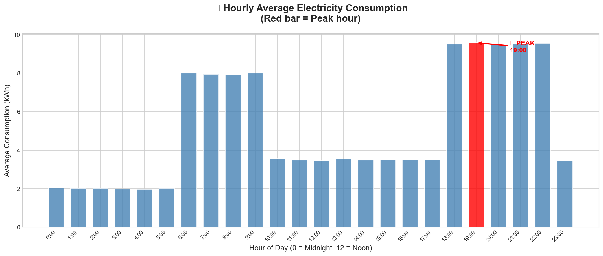
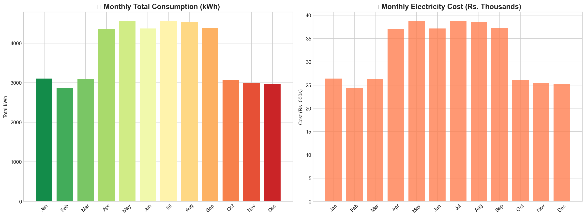

# Smart Energy Consumption Analysis

## Project Overview
This project analyzes electricity consumption data to identify usage patterns, peak hours, and energy waste.

## Tools Used
- Python
- Pandas
- Matplotlib
- Seaborn
- Power BI

## Key Insights
- Peak Hour: 19:00
- Average Consumption: 5.12 kWh
- Total Annual Cost: ₹381,562
- Night Energy Waste: ₹26,202

## Features
- Hourly consumption analysis
- Peak usage detection
- Monthly energy trends
- Zone-wise consumption analysis
- Cost optimization recommendations

## Output
Hourly consumption visualization highlighting peak usage.

## Visualization

- 
- 
- 

## Future Work
Create interactive dashboard in Power BI.
